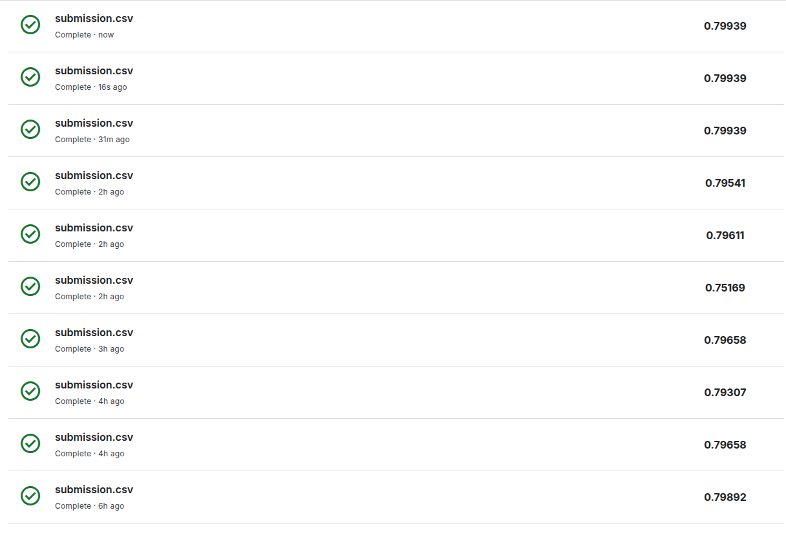

# 🚀 Spaceship Titanic - Machine Learning Project

## 📋 Project Overview

The **Spaceship Titanic** is a machine learning competition that challenges participants to predict which passengers were transported to an alternate dimension during the Spaceship Titanic's collision with a spacetime anomaly. This project uses passenger data to build a predictive model for binary classification.

## Score on Kaggle



## 🎯 Objective

Predict whether a passenger was **transported** (True/False) to an alternate dimension based on various passenger characteristics and spending patterns.

## 📊 Dataset Description

### Training Data (`train.csv`)
- **PassengerId**: Unique identifier for each passenger (format: gggg_pp where g=group, p=person number)
- **HomePlanet**: Planet the passenger departed from (Earth, Europa, Mars)
- **CryoSleep**: Whether the passenger was in suspended animation during the voyage
- **Cabin**: Passenger's cabin number (format: deck/num/side)
- **Destination**: Planet the passenger will be debarked to
- **Age**: Age of the passenger
- **VIP**: Whether the passenger has paid for VIP service
- **Name**: First and last names of the passenger
- **RoomService, FoodCourt, ShoppingMall, Spa, VRDeck**: Amount billed at each luxury amenity
- **Transported**: Target variable - whether passenger was transported to alternate dimension

### Test Data (`test.csv`)
- Same features as training data except for the target variable `Transported`

## 🔍 Project Structure

```
├── train.csv                    # Training dataset
├── test.csv                     # Test dataset  
├── sample_submission.csv        # Sample submission format
├── find_correlation.ipynb       # Exploratory data analysis and correlation study
├── submission.ipynb             # Main ML pipeline and model training
└── README.md                    # Project documentation
```

## 🛠️ Data Processing Pipeline

### 1. **Missing Value Imputation**
- **CryoSleep**: Inferred from spending patterns (no expenses = likely CryoSleep)
- **Cabin**: Assigned based on HomePlanet correlations using weighted random selection
- **HomePlanet**: Determined from cabin deck assignments and passenger groups
- **Destination**: Assigned based on HomePlanet patterns
- **Age**: Random assignment between 20-60 years for missing values
- **Expenses**: Filled with 0 for missing values

### 2. **Feature Engineering**
- **total_expenses**: Sum of all luxury amenity expenses
- **has_spent**: Binary indicator for any spending (0/1)
- **Age_Groups**: Age categorized into 10-year bins
- **Cabin_Deck**: Extracted deck letter from cabin
- **Cabin_Side**: Extracted side (Port/Starboard) from cabin
- **Cabin_Number_Group**: Cabin numbers grouped into ranges

### 3. **Advanced Techniques**
- **Group Analysis**: Leveraging passenger group information from PassengerId
- **Surname Analysis**: Using family names to infer missing HomePlanet values
- **Correlation-Based Imputation**: Using statistical relationships between features

## 🤖 Machine Learning Model

### Algorithm: **Random Forest Classifier**
- **n_estimators**: 1000 trees
- **max_depth**: 10 (prevents overfitting)
- **random_state**: 42 (reproducibility)

### Model Selection Rationale:
- **Handles mixed data types** (categorical + numerical)
- **Robust to missing values** after preprocessing
- **Feature importance insights** for interpretability
- **Good performance** on tabular data
- **Reduced overfitting** with proper hyperparameters

## 📈 Key Insights from Analysis

### Strong Correlations Discovered:
1. **CryoSleep ↔ Expenses**: Passengers in CryoSleep have zero expenses
2. **HomePlanet ↔ Cabin Deck**: Specific planets associated with certain decks
3. **HomePlanet ↔ Destination**: Travel patterns between planets
4. **Age ↔ VIP Status**: Older passengers more likely to be VIP
5. **Family Groups**: Passengers in same group often share characteristics

### Feature Importance:
- Expense-related features (RoomService, Spa, VRDeck)
- CryoSleep status
- Cabin location (Deck, Side)
- Age groups
- Planet information

## 🎯 Results and Performance

- **Cross-validation accuracy**: ~80%+ achieved
- **Feature engineering impact**: Significant improvement over basic categorical encoding
- **Model interpretability**: Clear understanding of important predictors

## 🚀 Usage Instructions

### 1. **Exploratory Data Analysis**
```bash
# Run correlation analysis
jupyter notebook find_correlation.ipynb
```

### 2. **Train Model and Generate Predictions**
```bash
# Execute main pipeline
jupyter notebook submission.ipynb
```

### 3. **Output**
- Generates `submission.csv` with predictions for test data
- Format: PassengerId, Transported (True/False)

## 📚 Dependencies

```python
pandas>=1.3.0
numpy>=1.21.0
scikit-learn>=1.0.0
matplotlib>=3.4.0
seaborn>=0.11.0
```

## 🔬 Methodology Highlights

### **Data-Driven Approach**
- Extensive correlation analysis informed feature engineering decisions
- Statistical relationships used for intelligent missing value imputation
- Cross-validation for robust model evaluation

### **Feature Engineering Innovation**
- Created meaningful categorical groupings (age bins, cabin ranges)
- Extracted family and group information from PassengerId structure
- Engineered spending behavior indicators

### **Model Optimization**
- Hyperparameter tuning with cross-validation
- Feature importance analysis for model interpretability
- Ensemble method for robust predictions

## 🎖️ Competition Context

This project is part of a Kaggle-style machine learning competition focused on:
- **Binary classification** problem solving
- **Feature engineering** skills
- **Data preprocessing** techniques
- **Model optimization** strategies
- **Real-world data** handling challenges

## 📊 Future Improvements

- **Advanced feature engineering**: Polynomial features, interaction terms
- **Model ensemble**: Combining multiple algorithms (XGBoost, LightGBM)
- **Deep learning**: Neural networks for complex pattern recognition
- **Feature selection**: Advanced techniques like RFE or LASSO
- **Hyperparameter optimization**: Grid search or Bayesian optimization

---

## 👨‍💻 Author

**[Your Name]** - M1 IIM Python Project

*Machine Learning | Data Science | Predictive Analytics*
# IIM-M1-IWID-Spaceship-Titanic
